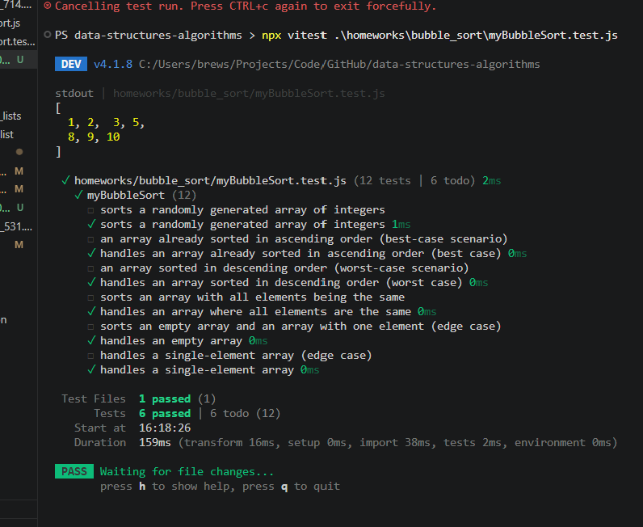

# Summary Report

## what is bubble sort?
- walk through an array comparing each pair of adjacent elements
- swap the elements if they are in the wrong order
- each full pass "bubbles" the largest unsorted element to its correct position at the end of teh array
- this process repeats until a full pass makes no swaps, and then we know the array is sorted

- there are typically two nested loops
- the outer loop controls how many passes are made
- the inner loop does the adjacent comparisons and swaps

- "shrinking range": after each pass, the largest remaining element is guaranteed to be in its final position at the end, so the inner loop's range can shrink by one each time 
- this means you don't need to recheck the "tail" of the array

- if an entire pass completes with zero swaps, the array is already sorted
- this means you can break out early, which makes bubble sort O(n) on an already-sorted array, instead of always O(n²)
- average & worst case is O(n²)

## complexity summary:
- average & worst case is O(n²)
- O(n) best case with the early-exit optimization
- O(1) extra space since it sorts in place

## implementation logic 
- implementation logic for both the basic and optimized Bubble Sort implementations,

## testing descriptions and results
- description of each test case and the results (show photo?)
- run `npx vitest .\homeworks\bubble_sort\myBubbleSort.test.js`

