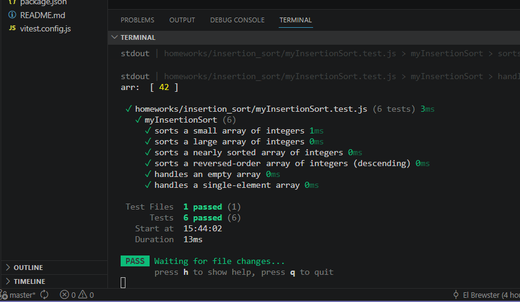

# Summary Report

## what is insertion sort?
Insertion sort works by building up a sorted portion of the array one element at a time, taking each new element and inserting it into its correct position among the elements already sorted.

## complexity summary:
- O(n²) in the worst and average case (reverse-sorted input causes maximum shifting)
- but actually quite fast being O(n) on data that's already nearly sorted
- this is why it's sometimes used as a finishing pass in hybrid sorting algorithms like Timsort.

## testing descriptions and results

