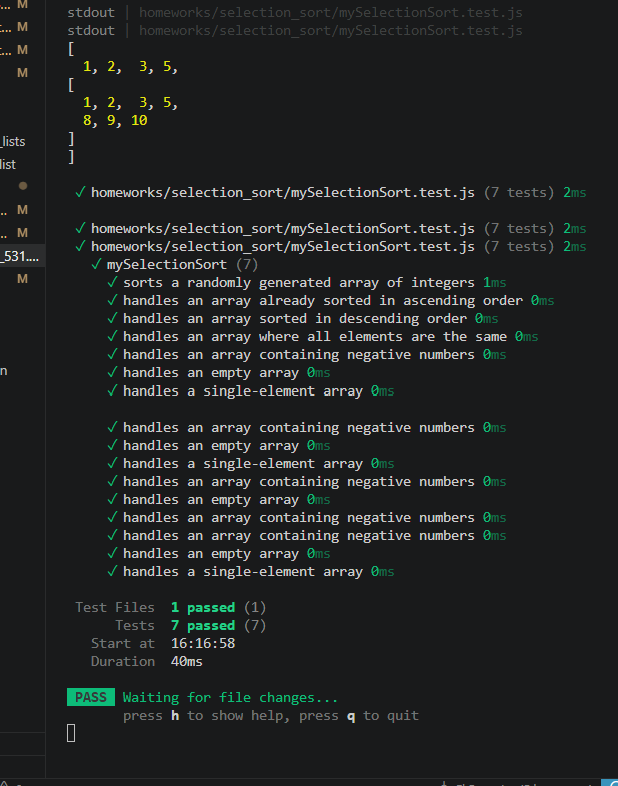

# Summary Report

## what is selection sort?
- repeatedly find the minimum (or maximum) element from the unsorted portion of the array
- swap it into its correct position at the front of that unsorted portion
- selection sort does exactly one swap per pass

## complexity summary:
- selection sort always performs exactly n-1 swaps total
- this makes it useful when swaps are expensive, like when writing to flash memory
- it gets no speedup on already-sorted input
-  it always does the full n² comparisons because it has no way to detect that the array is sorted early

## testing descriptions and results
- description of each test case and the results (show photo?)

## stability
- selection sort is not stable by default
- (the basic versions of insertion sort and bubble sort are stable)